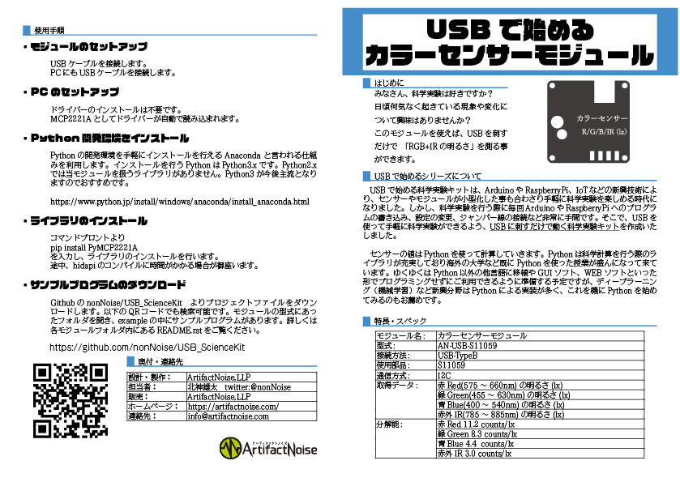

========================================================================
カラーセンサーモジュール
========================================================================

作成日:2018/05/01

■ 概要
------------------------------------------------------------------------

USBで手軽に物体の色をデジタルで計測することが出来ます。

■ サンプルプログラム
------------------------------------------------------------------------

git clone https://github.com/nonNoise/USB_StartUpModule.git

pip install PyMCP2221A

cd ./USB_StartUpModule/AN-USB-S11059/example

■ 参考資料
------------------------------------------------------------------------

::
    
    MIT License
    Copyright (c) 2018 ArtifactNoise,LLP/Yuta Kitagami   
